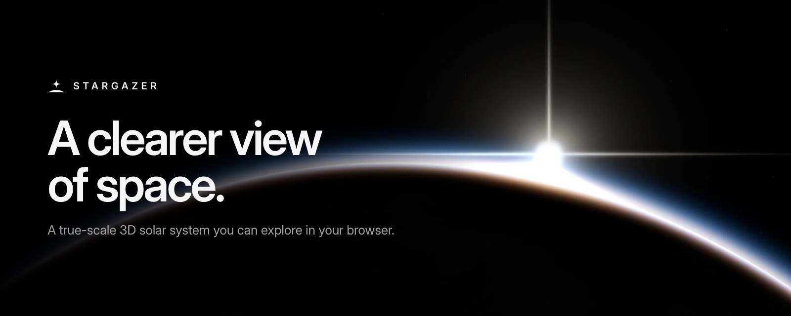
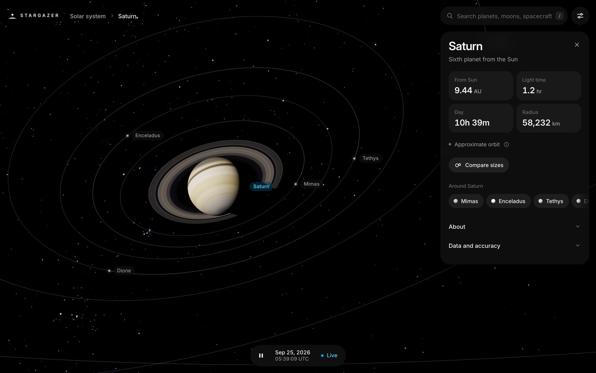
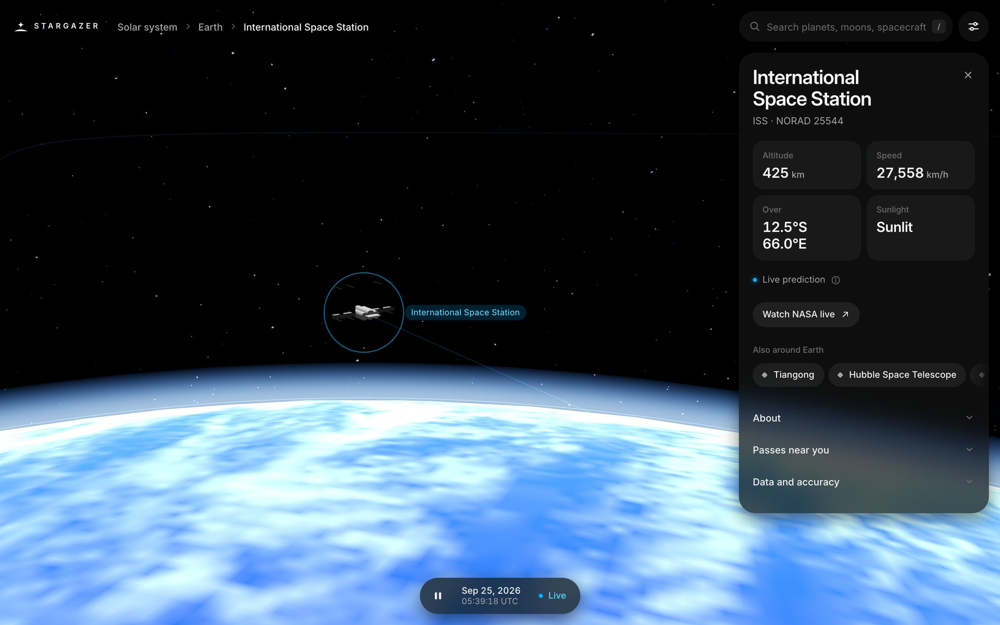
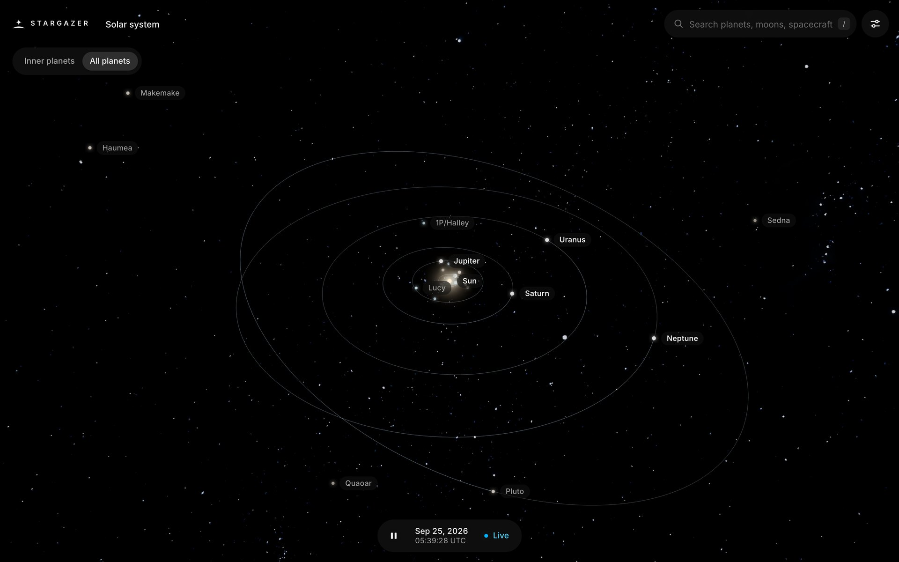
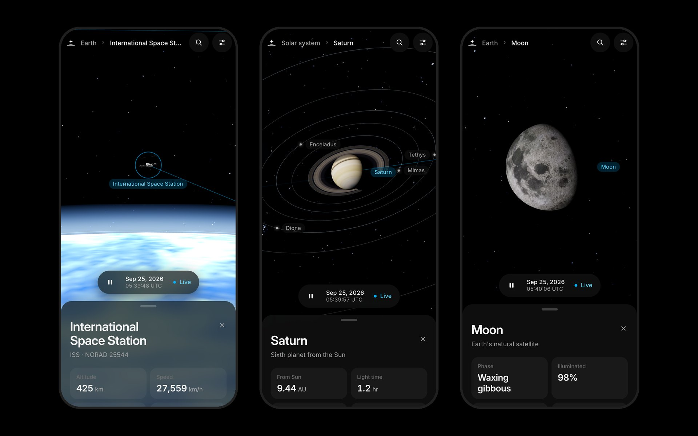

<p align="center">
  <a href="https://stargazer-lab.vercel.app"></a>
</p>

<p align="center">
  <strong>A true-scale 3D solar system you can explore in your browser.</strong><br />
  Planets, moons, spacecraft and live satellites, placed with public data and honest about its limits.
</p>

<p align="center">
  <a href="https://stargazer-lab.vercel.app/app"><strong>Launch explorer</strong></a>
  &nbsp;&middot;&nbsp;
  <a href="https://stargazer-lab.vercel.app">Website</a>
  &nbsp;&middot;&nbsp;
  <a href="#data-and-accuracy">Data and accuracy</a>
  &nbsp;&middot;&nbsp;
  <a href="https://github.com/dyascj/stargazer/issues">Report an issue</a>
</p>

<br />



## Overview

Stargazer is a quieter, more beautiful take on [NASA's Eyes on the Solar System](https://eyes.nasa.gov/apps/solar-system/). Open it and you get the sky, one search field, and a clock. Everything else appears when you ask for it.

- **True scale.** Every distance and radius is physical, from the ISS at 400 km to Voyager 1 past 170 AU. Constant-size markers keep small worlds findable.
- **Sourced and dated.** Every object says where its position comes from and how old that data is.
- **Search first.** Type a name, a nickname (Webb, 67P) or a NORAD number and fly there.
- **Live satellites.** CelesTrak elements propagated with SGP4 at the time you are looking at, with pass predictions for your location.
- **Time travel.** Scrub planets between 1800 and 2050, pause, reverse, or jump back to now.
- **Built for phones.** A draggable details sheet, gestures that match the desktop, and a view that recenters above the sheet.

<p>
  
  
</p>



## Controls

| Action                  | Mouse and keyboard | Touch       |
| ----------------------- | ------------------ | ----------- |
| Rotate                  | Drag               | One finger  |
| Zoom                    | Scroll             | Pinch       |
| Pan                     | Right-drag         | Two fingers |
| Fly to a body           | Click it           | Tap it      |
| Recenter                | Double-click, `R`  | Double-tap  |
| Search                  | `/` or `⌘K`        | Search icon |
| Play or pause           | `Space`            |             |
| Faster or slower        | `+` / `-`          |             |
| Back to now             | `N`                |             |
| Next or previous planet | `←` / `→`          |             |
| Solar system overview   | `H`                |             |
| Hide interface          | `F`                |             |
| Close or go back        | `Esc`              |             |

Settings holds layer switches, a copyable link to the current view (including the simulated date and speed), and this list.

## Data and accuracy

Stargazer is an educational visualization. Each model has a stated method and stated limits:

| Data                         | Method and limits                                                                                                                                                    |
| ---------------------------- | -------------------------------------------------------------------------------------------------------------------------------------------------------------------- |
| Planets and Pluto            | JPL approximate planetary elements with a safeguarded Kepler solver, valid 1800 to 2050.                                                                             |
| Earth and the Moon           | Truncated lunar model. Earth is placed at the geocenter, offset from the JPL Earth-Moon barycenter by the same model. Not suitable for eclipse timing.               |
| Other moons and small bodies | Two-body propagation of dated JPL Horizons elements, refreshed weekly. Perturbations and maneuvers are omitted.                                                      |
| Planet orbiters              | Dated Horizons elements, shown only within 30 days of their epoch.                                                                                                   |
| Cruise spacecraft            | Fixed Horizons positions. The details card shows the snapshot date.                                                                                                  |
| Rovers and landers           | Landing coordinates, not current traverses.                                                                                                                          |
| Webb                         | Placed at the Sun-Earth L2 point, about 1.5 million km beyond Earth. Its halo orbit around L2 is not modeled.                                                        |
| Earth satellites             | CelesTrak TLEs propagated with satellite.js SGP4 at the simulated time, limited to 7 days either side of the element epoch. The window does not guarantee precision. |
| Launches                     | The Space Devs Launch Library 2. Schedules are provisional; SpaceX launches arrive through this feed.                                                                |

One scene unit is Earth's mean radius (6,371 km), so 1 AU is about 23,481 units. The Sun, planets, moons and rings are drawn at their physical radii, moons and satellites at their true distances, and the ISS at its 109 m span. Positions are composed in double precision, so there is no visible jitter from low Earth orbit out to Voyager 1. Clouds, city lights, atmospheric scattering and ring shading are illustrative, not weather or radiative-transfer simulations.

Time is shown in UTC. Horizons epochs are TDB, and the simple propagation treats UTC as TDB, which introduces an offset of about a minute near the present. The planetary scene applies no light-time, aberration or observer-location corrections.

The test suite checks positions against 30 independent JPL Horizons reference vectors at three epochs, reproduces Vallado's SGP4 verification case, and covers solver edge cases, camera framing, simulation state, registry invariants, search ranking, and API and refresh failure handling.

## Run locally

Requires Node 22.12 or newer.

```sh
npm ci
npm run dev        # http://localhost:5174
```

The landing page (`/`) is prerendered and loads a small three.js hero after first paint. The explorer lives at `/app` and accepts `?body=<id>`, for example `/app?body=saturn`.

```sh
npm run check      # svelte-check and TypeScript
npm test           # accuracy and regression tests
npm run lint       # Prettier
npm run build      # production build (Vercel adapter)
```

### End-to-end tests

Playwright drives the production build on desktop Chrome, iPhone Safari (portrait and landscape) and Android Chrome, including touch gestures and axe accessibility scans.

```sh
npx playwright install chromium webkit
npm run test:e2e              # all devices
npm run test:e2e -- --project=iphone-safari
npm run test:e2e:docker       # same run in the CI image, for hosts WebKit does not support
```

CI runs lint, types, unit tests, the build, a dependency audit and every device project on each pull request.

No API keys are needed. An optional `NASA_API_KEY` in `.env` enables the NASA API proxy route. Satellite elements and launches need network access; unavailable feeds show an explicit state.

### Refresh ephemerides

```sh
node scripts/refresh-ephemeris.mjs --dry-run
node scripts/refresh-ephemeris.mjs
npx prettier --write src/lib/registry/bodies
npm test
```

Each record and its epoch update together, failed objects keep their previous elements, and files are replaced atomically. A scheduled GitHub Action runs this weekly. Mission descriptions and operational status still need editorial review.

## Project structure

| Path                         | Contents                                                        |
| ---------------------------- | --------------------------------------------------------------- |
| `src/lib/registry`           | Every object: data, parent relationships and position functions |
| `src/lib/utils`              | Orbital math, coordinate frames, validation and camera framing  |
| `src/lib/stores`             | Simulation clock, selection and live data feeds                 |
| `src/lib/components/scene`   | Rendering, markers and labels, and the camera rig               |
| `src/lib/components/layout`  | Search, details, time, settings and size comparison             |
| `src/lib/components/landing` | Landing page chapters and their self-contained three.js scenes  |
| `src/routes/api`             | Validated proxies for upstream data                             |
| `scripts`                    | Ephemeris refresh and the unit test suite                       |
| `e2e`                        | Playwright end-to-end tests across desktop and phones           |

Built with SvelteKit, Svelte 5, Threlte and three.js, satellite.js, and Inter. The design system is [Mizu](https://mizu-ui.com); motion takes cues from [bencho.dev](https://bencho.dev).

## Sources

- [JPL approximate planetary positions](https://ssd.jpl.nasa.gov/planets/approx_pos.html) and [JPL Horizons](https://ssd.jpl.nasa.gov/horizons/)
- [CelesTrak](https://celestrak.org/) and the [SGP4 verification data](https://celestrak.org/publications/AIAA/2006-6753/)
- [The Space Devs Launch Library 2](https://thespacedevs.com/llapi)
- [NASA planetary fact sheets](https://nssdc.gsfc.nasa.gov/planetary/factsheet/)
- [Solar System Scope textures](https://www.solarsystemscope.com/textures/) (CC BY 4.0) and NASA Earth imagery

Stargazer is not affiliated with NASA, JPL, ESA, JAXA or SpaceX. Agency logos in `static/logos` are trademarks of their owners, used only to credit data sources.

## License

A personal project by [Charles J. (CJ) Dyas](https://github.com/dyascj). Code is available under the [MIT license](LICENSE). Bundled third-party assets keep their own terms; see [third-party notices](THIRD_PARTY_NOTICES.md).
